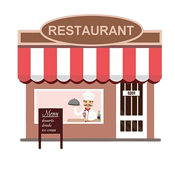

<a name="readme-top">

 

 

  
  <h3 align="center">S4-MACHINE PROBLEM</h3>

  This GitHub repository contains my output for the subject Advanced Web Design, featuring a restaurant guide created using HTML, CSS, and JavaScript.

 